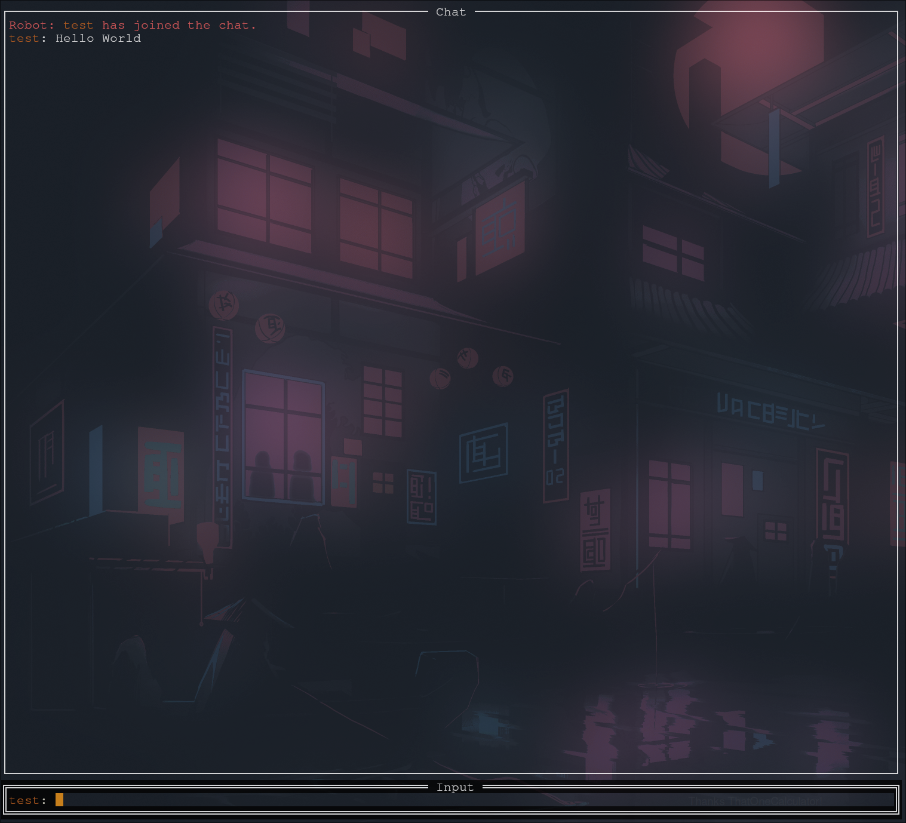

Terminal Chat Application

  

=========================

This Terminal Chat Application is a real-time communication tool built in Go, designed for  terminal enthusiasts to chat with others on their local network. It offers a chat experience directly from your terminal, featuring a user-friendly interface, customizable user colors, and support for special commands. The application leverages Go's concurrency features, the `tview` and `tcell` libraries for the UI, and supports dynamic user interactions.

Features
--------

-   **Real-Time Communication**: Engage in live chat  with minimal latency.
-   **Customizable User Interface**: Powered by `tview` and `tcell`, with support for custom colors.
-   **Special Commands**: Enhance your chat with special commands, offering additional functionalities like help instructions and fun animations.
-   **Dynamic User Colors**: Users are assigned unique colors for easier identification in the chat.
-   **Server Heartbeat Monitoring**: Ensures connection stability and alerts users to potential disconnects.

Getting Started
---------------

### Prerequisites

-   Go 1.15 or later
-   `git` for cloning the repository

### Installation

1.  **Clone the Repository**

bash

`git clone https://github.com/cameroncuttingedge/terminal-chat.git
cd terminal-chat`

1.  **Build the Application**

For the server:

bash

`go build -o server cmd/server/main.go`

For the client:

bash

`go build -o client cmd/client/main.go`

### Running the Application

1.  **Start the Server**

bash

`./server`

1.  **Connect as a Client**

bash

`./client -ip=<server_ip> -port=<server_port>`

*Note: Replace `<server_ip>` and `<server_port>` with the appropriate values provided by the server output.*

### Usage

-   Simply type your messages and press Enter to send.
-   Use Tab to toggle focus between the message input field and the chat view.
-   Special commands can be triggered with `!` followed by the command name (e.g., `!man` for instructions).

Contributing
------------

Contributions are welcome! Please feel free to submit pull requests, report bugs, or suggest new features.

License
-------

This project is licensed under the MIT License - see the LICENSE file for details.